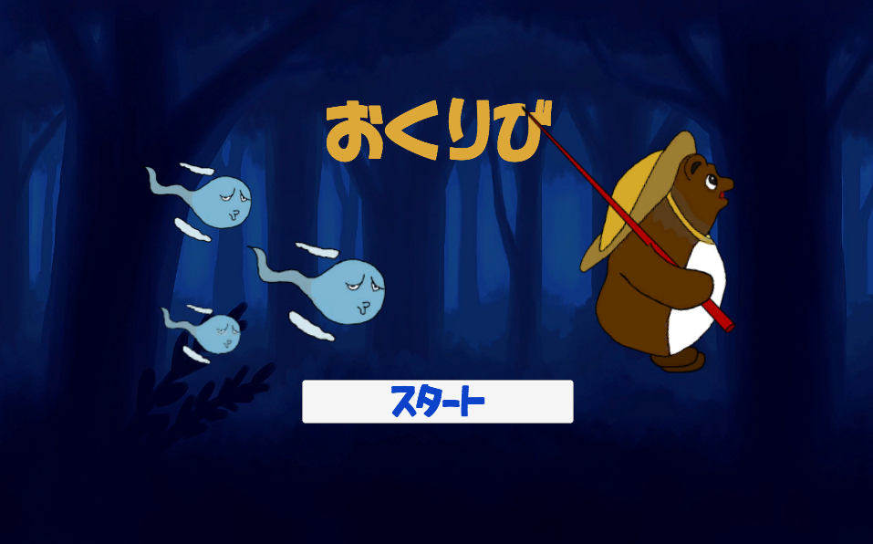
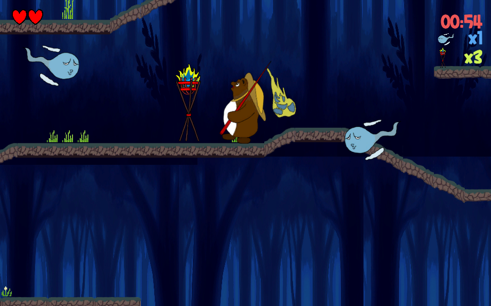
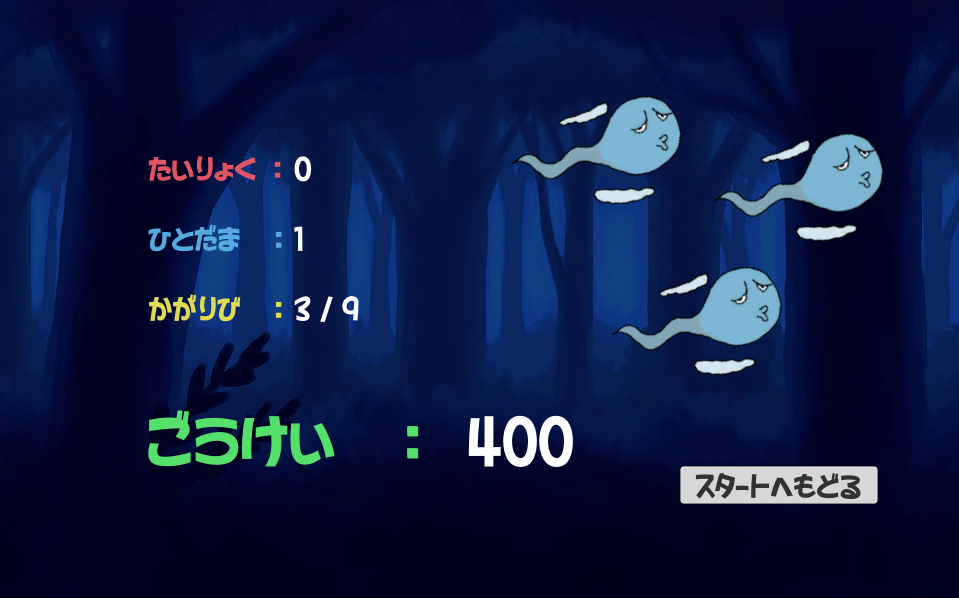

# おくりび

Unityで開発したスクロールアクションゲームです。

本ゲームはunity1weekという1週間でゲームを制作するゲームジャムに投稿しております。
ゲームジャムのテーマは「かえす」。個人制作で、プログラム含めキャラクターなど全て自身で作成しました。

プレイヤーは四方から追跡してくる「ひとだま」を「たぬきび」ではらいながら、コース中にある「おくりび」に火をつけていきます。
決められた時間内に火をつけられた「おくりび」とはらった「ひとだま」の数でスコアを競うことができます。

プレイヤーは釣り竿についた「たぬきび」を前後左右に振ることができ、これがブーメランのように返ってきます。
この攻撃機能実装にとくに注力しました。

---

## 技術スタック

| 項目                  | 内容                                |
|----------------------|-------------------------------------|
| エンジン             | Unity 2021.3.4f1                    |
| 言語                 | C#                                  |
| 対応プラットフォーム | WebGL                                  |

---

## 実行方法
以下リンクからプレイ可能です。

[Unityroom:おくりび](https://unityroom.com/games/okuribitanuki)

または、以下の方法でUnityプロジェクトから実行可能です。
1. Unity Hubで本プロジェクトフォルダを開く  
2. `Assets/Scenes/Main.unity`（または `StartScene.unity`）を起動  
3. Unityエディタ上部の ▶ ボタンで実行可能です

※初回起動時は依存ライブラリの再インポートが発生する可能性があります。

---

## スクリーンショット

以下に一部ゲーム画面のスクリーンショットを掲載します。

### スタート画面

### ゲームプレイ画面

### リザルト画面


---

## コメント・工夫した点

- 攻撃がブーメランのように一定距離まで到達して返ってくるという独特な動きを実装し独自性のある攻撃方法にしました。
- 短くさくさくと何度もプレイしてもらえるように敵の発生間隔やスピード、自キャラのスピードとジャンプ力などを調整できるプログラム設計にし、1週間という実装期間でも何度もレベル調整ができるように工夫しました。

---

## :file_folder: フォルダ構成（一部抜粋）
```
Assets/
 |-- Scenes/
 |-- Scripts/
 |-- Prefabs/
 |-- Materials/
 |-- Animations/
```
---

## ライセンスと利用条件

このリポジトリは**ポートフォリオ目的**で公開しています。  
著作権は制作者に帰属します。商用利用・無断転載はご遠慮ください。

---

## 制作者情報

- 名前：maruQen
- GitHub: [@enbas0721](https://github.com/enbas0721)
